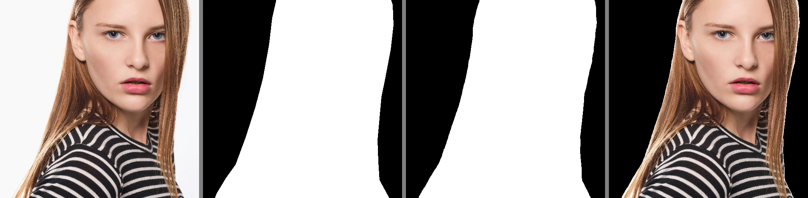
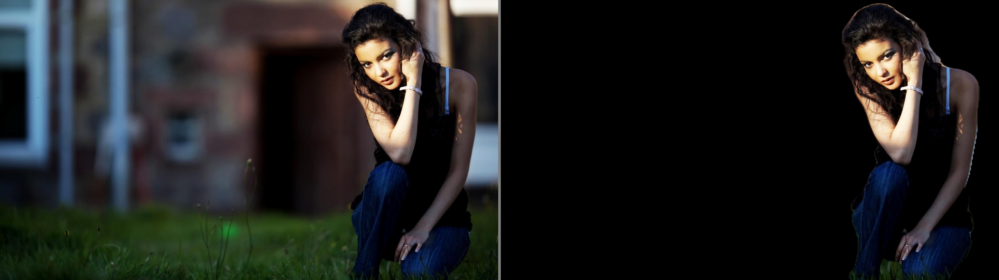
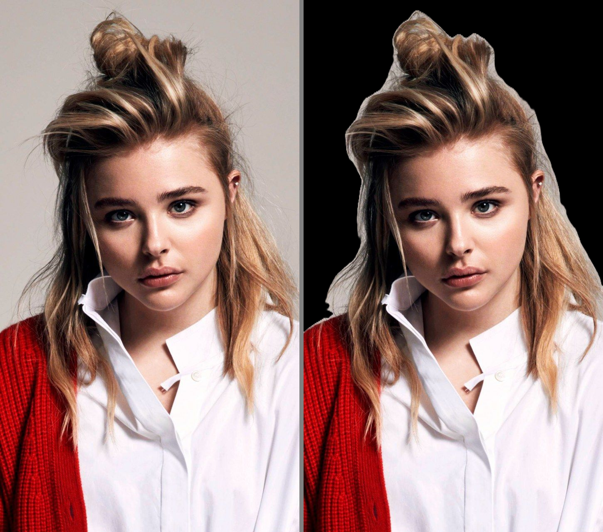
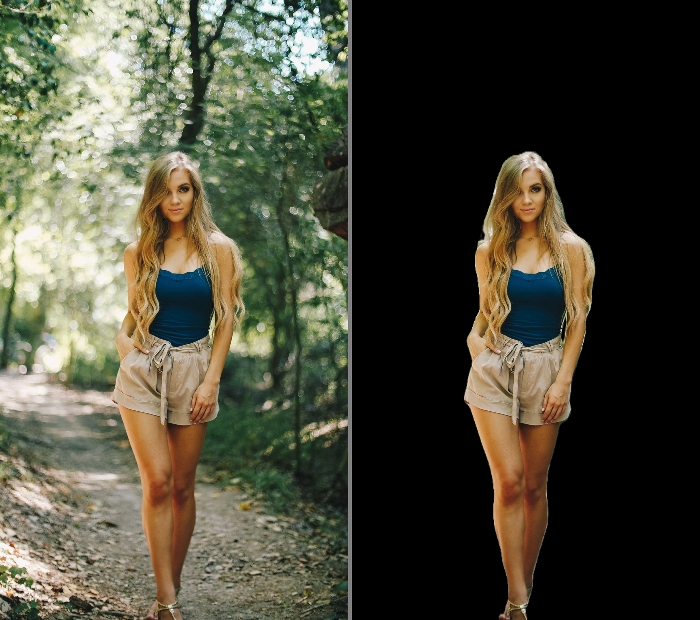

# Human Image Segmentation with DeepLabV3+ in TensorFlow
DeepLabV3+ with squeeze and excitation network for human image segmentation in TensorFlow 2.5.0    
Watch the YouTube video for better explaination: [https://youtu.be/4LhUpCWBzT8](https://youtu.be/4LhUpCWBzT8)

## Dataset
Download the dataset: [Person Segmentation](https://www.kaggle.com/nikhilroxtomar/person-segmentation/download)

## Weight file
Download the weight files from here: [model.h5](https://drive.google.com/file/d/17QKxSIBFhyJoDps93-sCVHnVV6UWS1sG/view?usp=sharing)

## Quantitative results
These results are on the validation/test set.
| Accuacy | F1 | Jaccard | Recall | Precision |
| :---: | :---: | :---: | :---: | :---: |
| 0.97404 | 0.95379 | 0.92124 | 0.95885 | 0.95683 |

## Qualtiative results
These qualitative results are on the validation/test set. The figure consists of a) Input Image b) Ground Truth Mask c) Predicted Mask d) Masked Image

:--------------------------------------------------------------------------------------:

These qualitative results are on random images taken from [https://wallpapercave.com](https://wallpapercave.com). The figure consists of a) Input Image b) Masked Image.

:--------------------------------------------------------------------------------------:

## Contact
For any query contact below:
- [Facebook](https://www.facebook.com/idiotdeveloper)
- [Instagram](https://instagram/nikhilroxtomar)
- [Telegram](t.me/idiotdeveloper)

